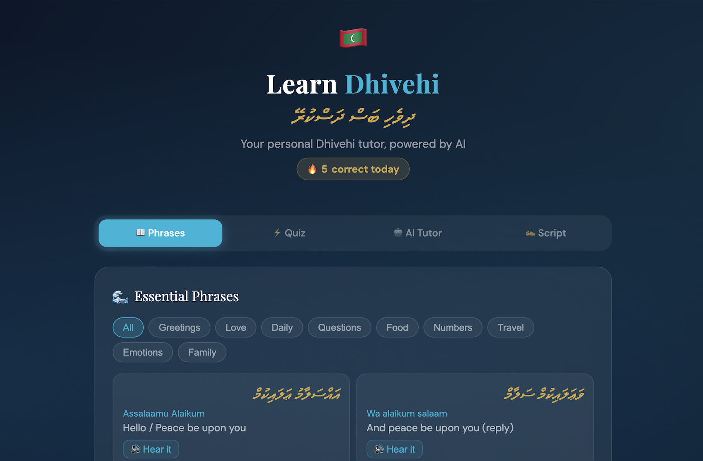

# 🇲🇻 Dhivehi Tutor

A personal Dhivehi language learning app, built for anyone wanting to connect with a Maldivian partner or just explore a beautiful and under-resourced language. Think of it as a lightweight Duolingo for Dhivehi — with an AI tutor powered by Claude.



---

## Features

- **Phrasebook** — 100+ phrases across 9 categories (greetings, love, daily life, questions, food, numbers, travel, emotions, family), each with Thaana script, phonetic pronunciation, and English meaning
- **Text-to-speech** — hear every phrase spoken aloud using the browser's built-in speech engine
- **Quiz** — multiple choice quiz that pulls from the full phrase library, with streak tracking
- **AI Tutor** — chat with a Claude-powered Dhivehi tutor; ask it to translate anything, explain grammar, or teach you new phrases
- **Thaana Script guide** — interactive reference for the Dhivehi alphabet and vowel diacritics (fili), with tap-to-hear

---

## Project Structure

```
dhivehi-tutor/
├── dhivehi-learn.html     # App shell — markup only, no inline JS or CSS
├── styles.css             # All styling
├── phrases.js             # Phrase data (PHRASES array) — edit this to add/correct phrases
├── app.js                 # All app logic (tabs, quiz, phrasebook, speech, chat)
├── server.js              # Express server — serves static files and proxies AI requests
├── ecosystem.config.cjs   # PM2 config for running on a server/Raspberry Pi
├── package.json
├── .env.example           # Template for environment variables
└── .gitignore
```

### How it works

The frontend is plain HTML, CSS, and vanilla JavaScript — no framework. `phrases.js` loads before `app.js` so the phrase data is available globally.

The Express server (`server.js`) does two things:
1. Serves the static frontend files
2. Exposes a `POST /api/chat` endpoint that forwards messages to the Anthropic API

The API key lives only in `.env` on the server — it is never sent to the browser.

---

## Running Locally

**Prerequisites:** Node.js 18+, an [Anthropic API key](https://console.anthropic.com/)

```bash
git clone https://github.com/YOUR_USERNAME/dhivehi-tutor.git
cd dhivehi-tutor
npm install
cp .env.example .env
# open .env and paste your ANTHROPIC_API_KEY
npm start
```

Then open [http://localhost:3000](http://localhost:3000).

For development with auto-restart on file changes:

```bash
npm run dev
```

---

## Hosting on a Raspberry Pi (with Tailscale)

This setup lets you access the app from your phone anywhere in the world, with your API key staying safely on your own hardware.

### 1. On the Pi — install dependencies

```bash
# Node.js
curl -fsSL https://deb.nodesource.com/setup_20.x | sudo -E bash -
sudo apt install -y nodejs

# PM2 (keeps the app running and restarts it on reboot)
sudo npm install -g pm2
```

### 2. On the Pi — clone and configure

```bash
git clone https://github.com/YOUR_USERNAME/dhivehi-tutor.git
cd dhivehi-tutor
npm install
cp .env.example .env
nano .env   # paste your ANTHROPIC_API_KEY
```

### 3. On the Pi — start the app

```bash
pm2 start ecosystem.config.cjs
pm2 save
pm2 startup   # follow the printed instruction to enable auto-start on reboot
```

The app is now running on port 3000.

### 4. Set up Tailscale

```bash
# On the Pi
curl -fsSL https://tailscale.com/install.sh | sh
sudo tailscale up
```

Install the [Tailscale app](https://tailscale.com/download) on your phone and sign in with the same account. Your Pi will appear in your Tailscale network with a stable hostname (e.g. `raspberrypi.tail12345.ts.net`).

Open your phone browser and navigate to:

```
http://raspberrypi.tail12345.ts.net:3000
```

It will work from anywhere as long as Tailscale is active on your phone.

### Updating after changes

```bash
cd dhivehi-tutor
git pull
npm install          # only needed if package.json changed
pm2 restart dhivehi-tutor
```

---

## Adding or Correcting Phrases

All phrase data lives in `phrases.js`. Each entry looks like this:

```js
{ dhivehi: 'ޝުކުރިއްޔާ', phonetic: 'Shukuriyya', english: 'Thank you', category: 'daily' }
```

Available categories: `greetings`, `love`, `daily`, `questions`, `food`, `numbers`, `travel`, `emotions`, `family`

> **Note:** The Dhivehi phrases were compiled with care but may contain inaccuracies — the language is under-resourced online. If you spot something wrong, a native speaker's correction is always preferred.

---

## Environment Variables

| Variable | Description |
|---|---|
| `ANTHROPIC_API_KEY` | Your Anthropic API key |
| `PORT` | Port to run the server on (default: `3000`) |
